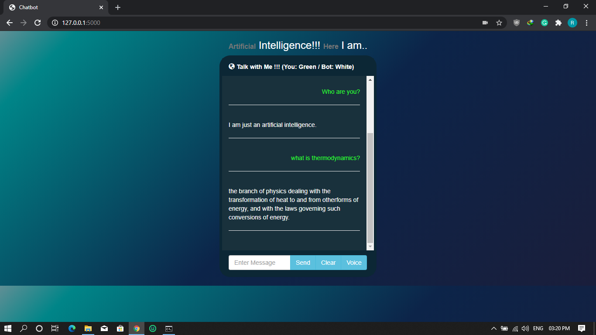

# A Simple ChatBot using ChatterBot and Flask

## What is a ChatBot?

A chatbot is a computer program that conducts the conversation between the user and a computer by using textual or auditory means. It works as a real-world conversational partner.

You have seen different chatbots in your life Siri, Cortana, Alexa, and so forth. As per a review, the chatbot is required to finish around 80% of all works in the coming decades. Presently, chatbots are practically finishing 30% of the tasks. With the expanding boom, it has turned out to be imperative to learn Machine Learning and Artificial Intelligence.

## Working of ChatterBot

ChatterBot is a Python library that makes it easy to generate automated responses to a user’s input. ChatterBot uses a selection of machine learning algorithms to produce different types of responses. This makes it easy for developers to create chat bots and automate conversations with users. The language independent design of ChatterBot allows it to be trained to speak any language. Additionally, the machine-learning nature of ChatterBot allows an agent instance to improve it’s own knowledge of possible responses as it interacts with humans and other sources of informative data.

The chatterbot works in the following manner:

- Get the input from the user.
- Process the input.
- Returns the value that is generated with the highest confidence value.
- Return the response to the user.

## Working of the Project

First, the chatbot is trained with a set of training data present in `/data` directory and creates a sqlite3 database. When the users inputs a query the bot searches for a response from the database if it finds an answer then it prints the response or else it will search for an answer from Wikipedia using web scraping and provide an appropriate response.

## Getting Started

These instructions will get you a copy of the project up and running on your local machine for development and testing purposes. Make sure you have Python installed on your machine.

### Setting up the Project

- Clone the repository using

```bash
git clone https://github.com/VRohit1901/ChatBot-Flask
```

- Open the terminal/cmd and navigate to the project folder.

```bash
cd ChatBot-Flask
```

- Install the requirments.txt using

```bash
pip install requirments.txt
```

- Requirments.txt will install all the required dependancies.

### Usage

- Now run the `chatbot.py` using

```bash
python chatbot.py
```

Congrats! The app should now be running on <http://localhost:5000>

- Open `http://localhost:5000` in your browser to interact with the chatbot.

### Preview



## How do I deploy this to a web server?

If you do not have a dedicated server, I highly recommend using PythonAnywhere, AWS or Heroku to host your application.

## Reference

- [ChatterBot](https://github.com/gunthercox/ChatterBot)

## Contributing

Contributions are what make the open-source community such an amazing place to learn, inspire, and create. Any contributions you make are **greatly appreciated**.

1. Fork the Project
2. Create your Branch
3. Commit your changes
4. Push to the Branch
5. Open a Pull Request

## License

Distributed under the [GNU General Public License v3.0](https://choosealicense.com/licenses/gpl-3.0/). See `LICENSE` for more information.